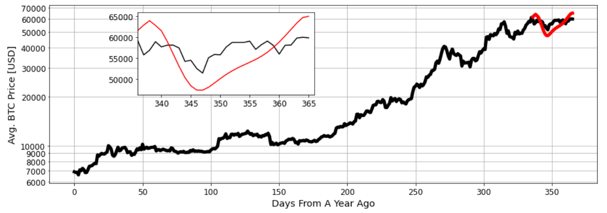

# Bitcoin Price Prediction through LSTM network

This jupyter notebook provides a short tutorial on a sample application of Long Short-Term Memory (LSTM) model on
bitcoin price data. The data are retrieved through the API of blockchain.info as daily USD prices averaged from
major exchanges. The notebook also includes a brief analysis and a discussion on optimizers and loss functions.

## Installation

This notebook uses pytorch. The dependencies of pytorch and all other python libraries used in the notebook are included in the standard anaconda3 installation.

## Meta

Tuguldur Sukhbold – tuguldur.s@gmail.com

Distributed under the MIT license. See ``LICENSE`` for more information.

[https://github.com/tuguldurs/btc_LSTM](https://github.com/dbader/)

<!-- Markdown link & img dfn's -->
[npm-image]: https://img.shields.io/npm/v/datadog-metrics.svg?style=flat-square
[npm-url]: https://npmjs.org/package/datadog-metrics
[npm-downloads]: https://img.shields.io/npm/dm/datadog-metrics.svg?style=flat-square
[travis-image]: https://img.shields.io/travis/dbader/node-datadog-metrics/master.svg?style=flat-square
[travis-url]: https://travis-ci.org/dbader/node-datadog-metrics
[wiki]: https://github.com/yourname/yourproject/wiki
